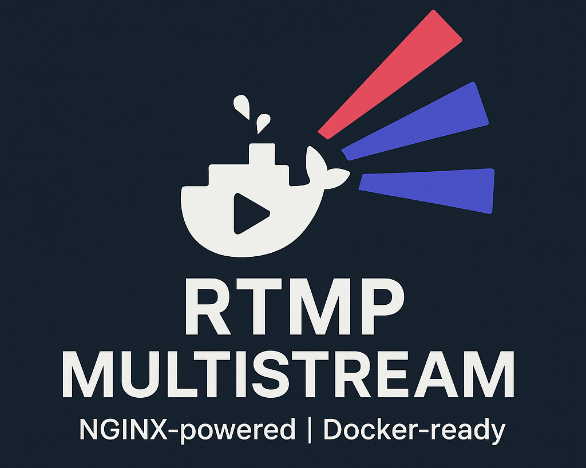

# JacobSanford/docker-rtmp-multistream

This is a lightweight nginx-based RTMP relay/encoder with comprehensive input validation and security features.

It is intended to complement traditional streaming software (OBS, etc.) by providing a single endpoint that relays the stream simultaneously to multiple services, and archives it to a local disk.

This project works best if deployed on a dedicated PC, separate from the one running your streaming software.

**[Read the Documentation](https://jacobsanford.github.io/docker-rtmp-multistream/)**

## Features
- ✅ Multi-platform streaming (Twitch, YouTube)
- ✅ Automatic transcoding and quality optimization
- ✅ Local disk archiving
- ✅ **Comprehensive input validation** - 113 security tests
- ✅ **Command injection prevention** - All inputs validated
- ✅ **Configurable log levels** - Prevent secret exposure
- ✅ IP-based publish authorization
- ✅ Fully tested (146 automated tests)

## Supported Streaming Services
* **Twitch** - Automatic transcoding and quality optimization
* **YouTube** - Direct pass-through relay
* **Archive** - Local disk recording

New/Additional services can easily be added. See the [Developer Guide](https://jacobsanford.github.io/docker-rtmp-multistream/developer/adding-services/) for details.

## Issues
Please report any issues or bugs you encounter by opening a new issue via the [Issues tab](https://github.com/JacobSanford/docker-rtmp-multistream/issues).

## Contributions
Contributions / Pull requests are welcome!

## License
MIT
