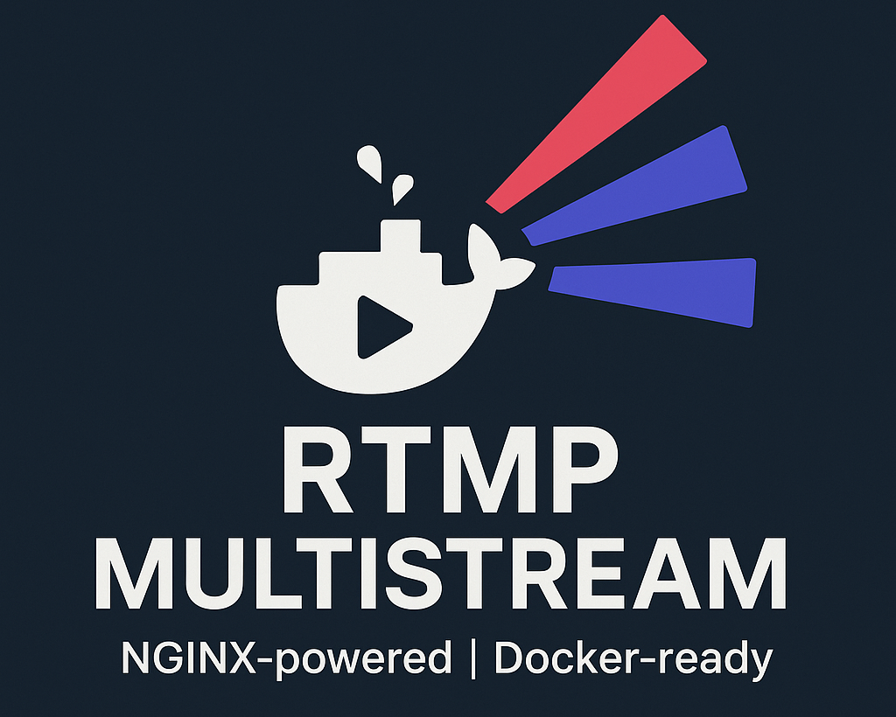

# JacobSanford/docker-rtmp-multistream

This is a lightweight nginx-based Real-Time Messaging Protocol (RTMP) relay/encoder with comprehensive input validation and security features.

It is intended to complement traditional streaming software (OBS, etc.) by providing a single endpoint that relays the stream simultaneously to multiple services, and can archive it to a local disk.

This project works best if deployed on a dedicated PC, separate from the one running your streaming software.

**[Read the Documentation](https://jacobsanford.github.io/docker-rtmp-multistream/)**

## Features
- Multi-platform streaming (Twitch, YouTube)
- Twitch transcoding to a configurable resolution and bitrate (non-partner mode; partners get the stream unchanged)
- Local disk archiving
- IP-based publish authorization

## Supported Streaming Services
* **Twitch** - Transcoded to a configurable resolution and bitrate, or passed through unchanged for partners (`TWITCH_PARTNER=TRUE`)
* **YouTube** - Direct pass-through relay
* **Archive** - Local disk recording

Additional services can be added. See the [Developer Guide](https://jacobsanford.github.io/docker-rtmp-multistream/latest/developer/adding-services/overview/) for details.

## Issues
Please report any issues or bugs you encounter by opening a new issue via the [Issues tab](https://github.com/JacobSanford/docker-rtmp-multistream/issues).

## Contributions
Contributions / Pull requests are welcome!

## License
This project is dual-licensed under the GNU Affero General Public License v3 (AGPLv3) and a commercial license. See [LICENSE](LICENSE) for the AGPLv3 terms. For use under different terms, for example in proprietary or commercial products, a commercial license is available: contact [jacob.josh.sanford@gmail.com](mailto:jacob.josh.sanford@gmail.com).
